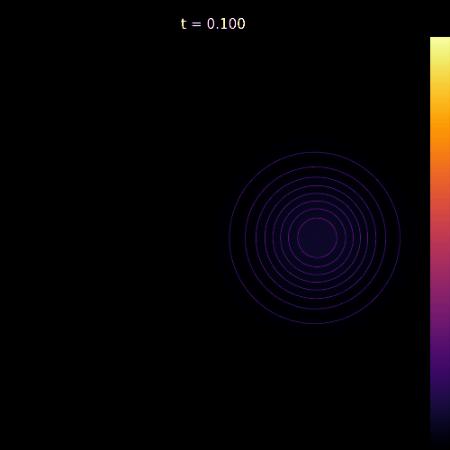
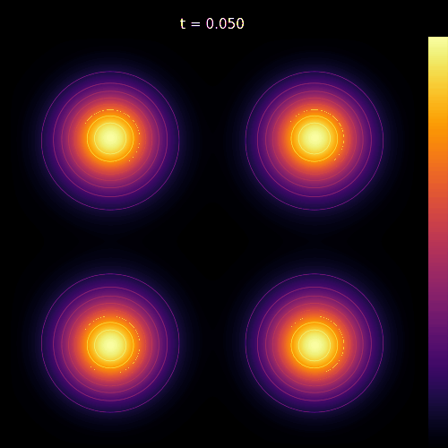
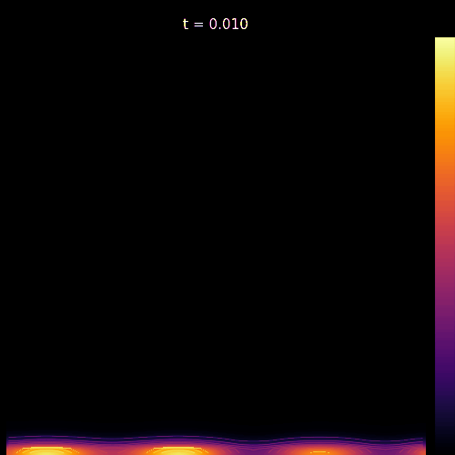

# Heat2D: a 2D heat equation solver

[](https://github.com/paurierap/heat-2D/actions/workflows/ci-tests.yml)

<div align="center">



</div>

## About

*Heat2D* is a C++ lightweight numerical library for solving 2D parabolic and elliptic partial differential equations (PDEs) of the form
```math
\frac{\partial u}{\partial t} = \nabla\cdot(\alpha\nabla u) + f,
```
where $u = u(x,y,t)$ usually represents a diffusive variable, $\alpha = \alpha(x,y)$ is the (linearly) space-dependent diffusivity and $f=f(x,y,t)$ is a source term. Only **axis-aligned, rectangular** 2D domains are considered.

This project is designed to separate the spatial discretization from the time integration in a modular and structured way. Sparse linear algebra is used with [Eigen](https://libeigen.gitlab.io) to improve performance and reduce memory consumption.

## Features

- Fully functional, structured 2D meshes with easy node/coordinate access.
- Boundary condition abstraction. Dirichlet and Neumann boundary conditions are supported.
- Second-order finite difference discretization for Laplace/Poisson equation.
- First and second-order time integration schemes are implemented, both explicit and implicit.
- Output PDE solutions in .csv format.

## Description

The project is centered around the association of classes representing the different concepts in the discretization of the general heat equation, revolving around the ```HeatPDE2D``` class.

### Preliminaries

The aforementioned parabolic PDE is fully characterized by defining the physical domain $\Omega\in\mathbb{R}^2$ alongside boundary conditions in the border $\partial\Omega =\partial\Omega_{l}\cup\partial\Omega_{r}\cup\partial\Omega_{b}\cup\partial\Omega_{t}$ (representing, respectively: left, right, bottom and top boundaries), thermal diffusivity $\alpha$, source $f$, and initial condition $u_0$ alongside an initial time $t_0$.

Possibly $\partial_t u=0$ and $-\nabla\cdot(\alpha\nabla u) = f$, in the so-called Poisson (Laplace if $f=0$) equation. This elliptic PDE can also be solved and does not require an initial condition. 

### Class hierarchy

```HeatPDE2D``` takes care of solver functionality and incorporates both the spatial discretization and the time integration. It thus requires an instance of both ```spatial::SpatialDiscretization2D``` and ```temporal::TimeIntegrator```. These are abstract base classes designed to provide a skeleton for their respective application.

#### Spatial discretization

```spatial::SpatialDiscretization2D``` represents the spatial discretization of the spatial term $\nabla\cdot(\alpha\nabla u)$ of the PDE in $\Omega$ and $\partial\Omega$. As such, it requires a mesh description (no *mesh-free* approaches), as well as boundary conditions, and the functions $\alpha$ and $f$. For the moment, the only implementation of this class is ```spatial::FiniteDifference2D```, which employs the finite difference method. 

Another abstract base class is represented in ```spatial::Mesh2D```, currently implemented by ```spatial::StructuredMesh2D``` (unstructured meshes are planned for the future). This can be instantiated by providing the utility ```struct Domain2D```, which defines the axis-aligned 2D rectangular domain $\Omega$ based on the coordinates of its sides: $x_l$, $x_r$, $y_b$ and $y_t$ (in this order); along with the number of desired nodes in each direction, $n_x$ and $n_y$.

Boundary conditions are specified as a map from ```DomainSide``` to an ```std::shared_ptr<BoundaryCondition>>```, supporting both 
```DirichletBoundaryCondition``` and ```NeumannBoundaryCondition```. Each takes a ```std::function<double(double,double,double)>``` describing the boundary value as a function of position and time.

Finally, ```spatial::SpatialDiscretization2D``` uses ```std::function<double(double,double,double)>``` to describe the source term $f$, and ```std::function<double(double,double)>``` for the diffusivity $\alpha$.

Internally, the problem is discretized using all these constructs into an ```Eigen::SparseMatrix<double>```, which is built once for increased performance. 

#### Time integrator  

```temporal::TimeIntegrator``` is the base class for a time integration scheme, either explicit or implicit. It only takes the timestep $dt$ as input parameter and defines the member function ```step```, which takes care of time-marching for a solution. There are currently three implementations for this class, each with a different ```step```:

- ```temporal::ExplicitEuler```: a first-order explicit time integrator. For the time being, no stability checks are made. It's up to the user to ensure the CFL condition holds
```math
\frac{dt}{h^2} < \frac{1}{4\alpha}
```
- ```temporal::ImplicitEuler```: a first-order implicit time integrator. The constant part of the resulting system of equations is pre-computed for increased performance using ```setUp```. If used without ```HeatPDE2D```, ```setUp``` is **must** be run *before* ```step```.
- ```temporal::CrankNicolson```: a second-order implicit time integrator. The same conditions for ```setUp``` as before apply here.

#### Solution writer

A small class ```SolutionWriter``` takes care of writing the output of the solution into a file in CSV format. 

## Build & Test

**Requirements:** C++17 compiler, CMake 3.14+, Eigen3

```bash
git clone https://github.com/paurierap/heat-2D
cd heat-2D
cmake -S . -B build
cmake --build build --parallel
ctest --test-dir build --verbose
```

To build the examples:
```bash
cmake -S . -B build -DBUILD_EXAMPLES=ON
cmake --build build --parallel
./build/examples/heat2d_examples
```

**Using in your own project:** Heat2D is a header-heavy library. Add it as a subdirectory in your CMake project:
```cmake
add_subdirectory(heat2D)
target_link_libraries(your_target PRIVATE HeatPDE)
```

## Usage

As an example, let us take the solution portrayed at the top of the README. Let us assume we want to solve the 2D heat equation with isolated boundary conditions (i.e., null Neumann BCs) in the unit square $\Omega=[0,1]\times[0,1]$, with a non-uniform $\alpha(x,y) = 0.005 + 0.02e^{-8(x-0.5)^2(y-0.5)^2}$. This thermal diffusivity is slightly higher in the center, therefore heat spreads faster in that region. 

Furthermore, we add a moving source term around a circle of radius $r=0.25$ centered at $(0.5,0.5)$ corresponding to a Gaussian pulse $f (x,y,t) = e^{-60(x-0.5+r\cos{t})^2(y-0.5+r\sin{t})^2}$. At $t_0=0$, we have $u_0=0$. We thus have
```math
\frac{\partial u}{\partial t} = \nabla\cdot\left(\alpha\nabla u\right) + f,
```
with
```math 
(\nabla u\cdot\mathbb{\hat{n}})|_{\partial\Omega_i}=0,\ \text{and}\ u (x,y,0) = 0.
```

### Meshing the domain

Two alternatives exist, using ```Domain2D``` or just directly the coordinates of $\partial\Omega$. Note that the order **must** be preserved. In addition, we use $n=n_x=n_y=101$:

```cpp
#include "StructuredMesh2D.hpp"

int n = 101;
double left = 0, right = 1, bottom = 0, top = 1;
spatial::Domain2D Omega{0, 1, 0, 1};

// From Domain2D
const spatial::StructuredMesh2D mesh(Omega, n, n);

// From side coordinates
const spatial::StructuredMesh2D mesh(left, right, bottom, top, n, n);
```

### Spatial Discretization

First, the boundary conditions over $\partial\Omega$ need to be specified. Since all sides are isolated, we can get away with one lambda function:

```cpp
#include <functional>

#include "NeumannBoundaryCondition.hpp"

auto zeroBC = [](double, double, double){return 0.0;};

spatial::BoundaryConditions bc;
bc[spatial::DomainSide::Left]   = std::make_shared<spatial::NeumannBoundaryCondition>(zeroBC);
bc[spatial::DomainSide::Right]  = std::make_shared<spatial::NeumannBoundaryCondition>(zeroBC);
bc[spatial::DomainSide::Bottom] = std::make_shared<spatial::NeumannBoundaryCondition>(zeroBC);
bc[spatial::DomainSide::Top]    = std::make_shared<spatial::NeumannBoundaryCondition>(zeroBC);
```

In addition, we must define the diffusivity $\alpha(x,t)$ and source $f(x,y,t)$ terms:

```cpp
// Thermal diffusivity
auto alpha = [](double x, double y) 
{
    double r = std::sqrt((x-0.5)*(x-0.5) + (y-0.5)*(y-0.5));
    return 0.005 + 0.02 * std::exp(-8.0 * r * r);
};

// Moving source
auto source = [](double x, double y, double t) 
{
    double cx = 0.5 + 0.25 * std::cos(t);
    double cy = 0.5 + 0.25 * std::sin(t);
    return 1.0 * std::exp(-60.0 * ((x-cx)*(x-cx) + (y-cy)*(y-cy)));
};
```

Finally, a ```FiniteDifference2D``` object can be instantiated:

```cpp
#include "FiniteDifference2D.hpp"

// Spatial discretization object
spatial::FiniteDifference2D fd(alpha, mesh, bc, source);
```

### Solving the heat equation

Once the spatial domain $\Omega$ has been discretized, we choose a time integrating scheme. For best performance, let us use ```CrankNicolson```. Then:

```cpp
#include "HeatPDE2D.hpp"

// Time integrator
double dt = 0.1;
temporal::CrankNicolson ti(dt);

// Initial condition
auto u0 = [](double, double){return 0.0;};

// Initialize heat equation solver
double t0 = 0;
HeatPDE2D solver(fd, ti, t0, u0);
```

Finally, the last step consists of integrating the heat equation and writing the solution on an output file in ```csv``` format. The convenience class ```SolutionWriter``` takes care of that. We will solve the heat equation until $t_f=4\pi$, corresponding to two full orbits of the moving source. The ```HeatPDE2D::integrate``` member function takes the final integration time $t_f$ and, optionally, a callback function that specifies how often should the solution be written on output. This function is called for every timestep when iterating over the integration time. The signature of the callback function is always ```auto callback = [&](double t, const Eigen::VectorXd& u```, where ```u``` is an Eigen vector containing the vectorized solution at time ```t```. Here we write the solution every *two* timesteps:

```cpp
#include <Eigen/Dense>
#include <string>

#include "SolutionWriter.hpp"

std::string output_filename = "moving-source.csv";
SolutionWriter writer(output_filename);

// Integrate solution and write on output_filename
double tf = 4.0 * M_PI;
int step = 0;
solver.integrate(tf, [&](double t, const Eigen::VectorXd& u)
{
    // Write every 2 steps
    if (step % 2 == 0) writer.write(mesh, u, t);
    ++step;
});
```

Plotting the data in ```moving-source.csv``` leads to a rather nice-looking animation!

## Examples

Many cool-looking physical animations can be simulated by tweaking the different variables/parameters of the heat equation. Two other examples are available in ```heat2D/examples/```:
- *Colliding pulses*: four initial Gaussian pulses are located at the center of each quadrant in $\Omega = [0,1]\times[0,1]$ with enforced null Dirichlet boundary conditions. Vertical diffusion is faster due to a non-linear thermal diffusivity $\alpha(y) = 0.01e^{-25(y-0.5)^2}$:

<div align="center">



</div>

- *Thermal mirage*: A sinusoidal Dirichlet boundary condition is applied at the bottom whilst keeping the rest of the borders isolated, generating the effect of a thermal mirage. There is no heat source nor initial condition. The domain heats up as a consequence of the boundary condition $u(x,0,t) = 0.5 + 0.1\sin{\left(2\pi x + t\right)} + 0.2\sin{\left(6\pi x- 2t\right)}$ and diffusivity $\alpha(y) = 0.02 + 0.01e^{-y}$:

<div align="center">



</div>