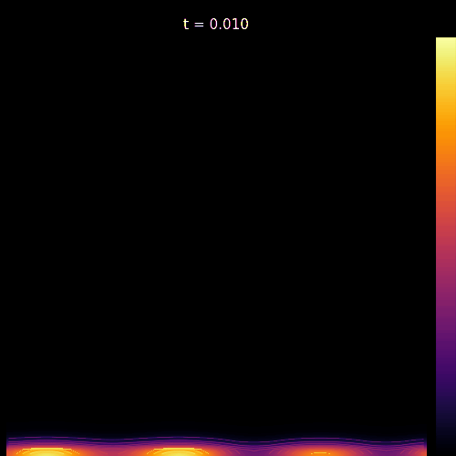
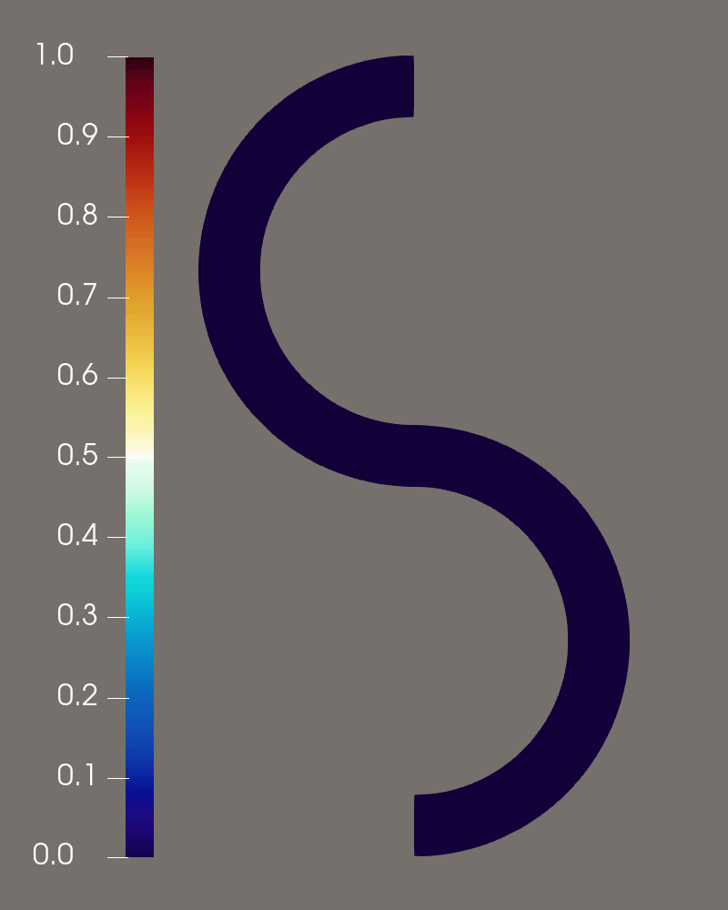

# Heat2D : a 2D heat equation solver

[](https://github.com/paurierap/heat-2D/actions/workflows/ci-tests.yml)

<div align="center">


</div>

## About

*Heat2D* is a C++ lightweight numerical library for solving 2D parabolic and elliptic partial differential equations (PDEs) of the form

```math
\frac{\partial u}{\partial t} = \nabla\cdot(\alpha\nabla u) + f,
```

where $u = u(x,y,t)$ usually represents a diffusive variable (such as temperature), $\alpha = \alpha(x,y)$ is the space-dependent diffusivity and $f=f(x,y,t)$ is a source term.

This project is designed to separate the spatial discretization from the time integration in a modular and structured way. [Eigen](https://libeigen.gitlab.io) provides sparse linear algebra to reduce memory use; optional [OpenMP](https://www.openmp.org) parallelism accelerates supported computations.

*Fun fact: the header animation is a simulation of temperature diffusing through the HEAT2D wordmark from a heated boundary at the left foot of the letter H. The rest of the boundaries (including holes) are insulated. For more details, see [FEM with an unstructured mesh](#fem-with-an-unstructured-mesh).*

## Features

- Structured and Gmsh-loaded unstructured 2D meshes with easy node/coordinate access.
- Boundary condition abstraction. Dirichlet, Neumann and Robin boundary conditions are supported, with string-tagged boundaries and time-dependent boundary values.
- Finite difference discretization (FDM) with a second-order interior approximation, and linear triangular finite element discretization (FEM).
- Space-dependent diffusivity and time-dependent source terms for transient heat diffusion and steady Laplace/Poisson problems.
- First and second-order time integration schemes are implemented, both explicit and implicit.
- Output PDE solutions in CSV or compressed VTU format, with PVD collections for animation in [ParaView](https://www.paraview.org/).

## Description

`HeatPDE2D` combines a spatial discretization with a time integrator to solve the heat equation.

### Preliminaries

The aforementioned parabolic PDE is fully characterized by defining the physical domain $\Omega\subset\mathbb{R}^2$ alongside boundary conditions on its border $\partial\Omega$, thermal diffusivity $\alpha$, source $f$, and initial condition $u_0$ alongside an initial time $t_0$. The boundary is divided into named groups with different boundary conditions, i.e. $\partial\Omega=\partial\Omega_D\cup\partial\Omega_N\cup\partial\Omega_R$, corresponding to Dirichlet, Neumann and/or Robin boundary conditions.

For steady-state problems, set $\partial_t u=0$, giving $-\nabla\cdot(\alpha\nabla u) = f$. This is a Poisson-type elliptic equation (Laplace's equation if $f=0$ and $\alpha$ is a positive constant). It does not require an initial condition or a time integrator. Call ```discretize()``` followed by ```solveSteadyState()``` on the spatial discretization; boundary and source functions are evaluated at $t=0$. A pure-Neumann steady problem requires a compatibility condition and a reference temperature, which are not imposed automatically.

### Class hierarchy

```HeatPDE2D``` takes care of solver functionality and incorporates both the spatial discretization and the time integration. It thus requires an instance of both ```solver::SpatialDiscretization2D``` and ```ode::TimeIntegrator```. These are abstract base classes designed to provide a skeleton for their respective application. Library classes live under the ```heat2d``` namespace.

#### Spatial discretization

```solver::SpatialDiscretization2D``` represents the spatial discretization of the spatial term $\nabla\cdot(\alpha\nabla u)$ of the PDE in $\Omega$ and $\partial\Omega$. As such, it requires a mesh description (no *mesh-free* approaches), as well as boundary conditions, and the functions $\alpha$ and $f$. Two implementations are available:

- ```solver::FiniteDifference2D``` employs the finite difference method on a ```mesh::StructuredMesh2D```, using diffusivity values at midpoints between neighboring nodes to approximate the divergence-form operator.
- ```solver::FiniteElement2D``` employs the Galerkin finite element method with linear, three-node triangles. It works with structured triangulations or unstructured meshes. Its final constructor argument selects the quadrature order.

Another abstract base class is represented in ```mesh::Mesh2D```, implemented by ```mesh::StructuredMesh2D``` and ```mesh::UnstructuredMesh2D```. The structured mesh can be instantiated by providing the utility ```struct Domain2D```, which defines the axis-aligned 2D rectangular domain $\Omega$ based on the coordinates of its sides: $x_l$, $x_r$, $y_b$ and $y_t$ (in this order); along with the number of desired nodes in each direction, $n_x$ and $n_y$. The unstructured mesh loads an already-generated Gmsh ```.msh``` file. For the moment, it requires first-order triangles in the XY plane and naming the boundary curves (associated later on with boundary conditions) with physical groups.

Boundary conditions are specified as a string-tagged ```bc::BoundaryConditions``` map to ```std::shared_ptr<bc::BoundaryCondition>```, supporting ```DirichletBoundaryCondition```, ```NeumannBoundaryCondition```, and ```RobinBoundaryCondition```. Dirichlet and Neumann take a ```std::function<double(double,double,double)>``` describing the boundary value as a function of position and time. Robin takes three such functions, ```(u_coeff, du_coeff, f)```, representing $u_{\mathrm{coeff}}u+du_{\mathrm{coeff}}\partial_n u=f$. For the moment, `u_coeff` should be time-independent if using FEM, since the system matrices are assembled once.

A Neumann value specifies the **outward normal derivative** $\partial_n u$, not the outward heat flux. For positive diffusivity, a positive value adds heat to the domain, a negative value removes it, and zero represents insulation. On a hole, the outward normal points from the material into the hole.

Finally, ```solver::SpatialDiscretization2D``` uses ```std::function<double(double,double,double)>``` to describe the source term $f$, and ```std::function<double(double,double)>``` for the diffusivity $\alpha$.

Internally, the problem is discretized using all these constructs into $M\dot{u}=Ku+b(t)$, with Eigen sparse mass and spatial-operator matrices. The matrices are built once for increased performance, whilst the source and boundary contributions are updated during time integration.

#### Time integrator

```ode::TimeIntegrator``` is the base class for a time integration scheme, either explicit or implicit. It only takes the timestep $dt$ as input parameter and defines the member function ```step```, which takes care of time-marching for a solution. There are currently three implementations for this class, each with a different ```step```:

- ```ode::ExplicitEuler```: a first-order explicit time integrator. For the time being, no stability checks are made. It's up to the user to choose a stable timestep. For constant positive diffusivity on the standard rectangular FDM grid, the usual restriction is

```math
dt \leq \frac{1}{2\alpha((\Delta x)^{-2}+(\Delta y)^{-2})}.
```

For equal spacings $\Delta x=\Delta y=h$, this reduces to $dt\leq h^2/(4\alpha)$. FEM, variable diffusivity and other boundary conditions require a stability limit based on the assembled operator rather than this formula.

- ```ode::ImplicitEuler```: a first-order implicit time integrator. The constant part of the resulting system of equations is pre-computed for increased performance using ```setUp```.
- ```ode::CrankNicolson```: a second-order implicit time integrator. Large timesteps can still introduce oscillations or lose temporal accuracy.

```HeatPDE2D``` calls ```discretize``` and ```setUp``` automatically. When using any integrator directly, including Explicit Euler, the spatial discretization must be assembled and ```setUp``` must be run *before* ```step```.

#### Solution writer

A small class ```SolutionWriter``` takes care of writing the output of the solution in CSV or compressed binary VTU format. CSV is useful for custom plotting; VTU preserves mesh connectivity for visualization of both rectangular and non-rectangular domains. VTU output also creates a PVD collection that can be opened directly in ParaView to animate the saved timesteps.

For example, ```SolutionWriter("results", SolutionWriter::FORMAT::VTU)``` writes ```results/results.pvd``` and numbered VTU files inside ```results/```. Writing the initial condition is explicit; the integration callback runs after each timestep.

## Build & Test

**Requirements:** C++17 compiler and CMake 3.20+ for the commands below. Eigen and zlib are required dependencies; CMake uses local installations when available and otherwise downloads and builds them automatically. GoogleTest follows the same system-first approach when building tests. These fallback downloads require network access. For offline builds, install the required development files locally and configure with `-DHEAT2D_FETCH_DEPENDENCIES=OFF`; missing dependencies then produce a configuration error. The project declares a CMake 3.14 minimum, but the GoogleTest fallback needs 3.16+ and ```ctest --test-dir``` needs 3.20+.

**Optional:** Gmsh headers and library enable ```UnstructuredMesh2D```. FEM on a structured mesh does not require Gmsh.

```bash
git clone https://github.com/paurierap/heat-2D
cd heat-2D
cmake -S . -B build
cmake --build build --parallel
ctest --test-dir build --verbose
```

To build and run an FDM example, from the repository root:

```bash
cmake -S . -B build -DHEAT2D_BUILD_EXAMPLES=ON
cmake --build build --target example-thermal-mirage --parallel
./build/examples/example-thermal-mirage
```

To build and run the wordmark FEM example using the existing `examples/heat2d_wordmark.msh` mesh, with Gmsh installed, from the repository root:

```bash
cmake -S . -B build -DHEAT2D_BUILD_EXAMPLES=ON -DHEAT2D_ENABLE_GMSH=ON
cmake --build build --target example-heat2d-diffusion --parallel
./build/examples/example-heat2d-diffusion
```

Useful CMake options are ```HEAT2D_BUILD_TESTS```, ```HEAT2D_BUILD_EXAMPLES```, ```HEAT2D_BUILD_BENCHMARKS```, ```HEAT2D_ENABLE_GMSH```, ```HEAT2D_ENABLE_OPENMP```, ```HEAT2D_ENABLE_NATIVE_ARCH``` and `HEAT2D_FETCH_DEPENDENCIES`. Tests default to ON for a standalone build, dependency fetching defaults to ON, Gmsh support defaults to detection, and the remaining options default to OFF.

### Using in your own project

Heat2D is a header-heavy library with compiled mesh and solver components. Add the repository root as a subdirectory in your CMake project. Assuming the repository is at ```heat-2D/```:

```cmake
# Make the bundled Gmsh finder available when embedding the project.
list(APPEND CMAKE_MODULE_PATH "${CMAKE_CURRENT_SOURCE_DIR}/heat-2D/CMake")
add_subdirectory(heat-2D)
target_link_libraries(your_target PRIVATE HeatPDE)
```

## Usage

### FDM with a structured mesh

Let us first solve a moving-source problem using FDM and a structured mesh. Let us assume we want to solve the 2D heat equation with insulated boundary conditions (i.e., null Neumann BCs) in the unit square $\Omega=[0,1]\times[0,1]$, with a non-uniform $\alpha(x,y) = 0.005 + 0.02e^{-8((x-0.5)^2+(y-0.5)^2)}$. This thermal diffusivity is slightly higher in the center, therefore heat spreads faster in that region.

Furthermore, we add a moving source term around a circle of radius $r=0.25$ centered at $(0.5,0.5)$ corresponding to a Gaussian pulse $f(x,y,t) = e^{-60((x-0.5-r\cos t)^2+(y-0.5-r\sin t)^2)}$. At $t_0=0$, we have $u_0=0$. We thus have

```math
\frac{\partial u}{\partial t} = \nabla\cdot\left(\alpha\nabla u\right) + f,
```

with

```math
(\nabla u\cdot\hat{n})|_{\partial\Omega}=0,\ \text{and}\ u(x,y,0)=0.
```

The snippets below form the body of a program's ```main``` function, with their ```#include``` directives placed at the top of the file. The moving-source problem also has a [complete example](examples/scripts/example-moving-source.cpp).

#### Meshing the domain

Two alternatives exist, using ```Domain2D``` or just directly the coordinates of $\partial\Omega$. Note that the order **must** be preserved. In addition, we use $n=n_x=n_y=101$:

```cpp
#include "StructuredMesh2D.hpp"

using namespace heat2d;

std::size_t n = 101;
double left = 0, right = 1, bottom = 0, top = 1;
mesh::Domain2D Omega{0, 1, 0, 1};

// From Domain2D
const mesh::StructuredMesh2D mesh(Omega, n, n);

// From side coordinates
// const mesh::StructuredMesh2D mesh(left, right, bottom, top, n, n);
```

#### Spatial Discretization

First, the boundary conditions over $\partial\Omega$ need to be specified. Since all sides are insulated, we can get away with one lambda function:

```cpp
#include <functional>
#include <memory>

#include "BoundaryConditions.hpp"
#include "NeumannBoundaryCondition.hpp"

auto zeroBC = [](double, double, double){
  return 0.0;};

bc::BoundaryConditions bc;
bc["Left"]   = std::make_shared<bc::NeumannBoundaryCondition>(zeroBC);
bc["Right"]  = std::make_shared<bc::NeumannBoundaryCondition>(zeroBC);
bc["Bottom"] = std::make_shared<bc::NeumannBoundaryCondition>(zeroBC);
bc["Top"]    = std::make_shared<bc::NeumannBoundaryCondition>(zeroBC);
```

In addition, we must define the diffusivity $\alpha(x,y)$ and source $f(x,y,t)$ terms:

```cpp
#include <cmath>

// Thermal diffusivity
auto alpha = [](double x, double y)
{
  double r = std::sqrt((x - 0.5) * (x - 0.5) + (y - 0.5) * (y - 0.5));
  return 0.005 + 0.02 * std::exp(-8.0 * r * r);
};

// Moving source
auto source = [](double x, double y, double t)
{
  double cx = 0.5 + 0.25 * std::cos(t);
  double cy = 0.5 + 0.25 * std::sin(t);
  return 1.0 * std::exp(-60.0 * ((x - cx) * (x - cx) + (y - cy) * (y - cy)));
};
```

Finally, a ```FiniteDifference2D``` object can be instantiated:

```cpp
#include "fdm/FiniteDifference2D.hpp"

// Spatial discretization object
solver::FiniteDifference2D fd(alpha, mesh, bc, source);
```

#### Solving the heat equation

Once the spatial domain $\Omega$ has been discretized, we choose a time integrating scheme. For second-order time integration, let us use ```CrankNicolson```. Then:

```cpp
#include "HeatPDE2D.hpp"
#include "CrankNicolson.hpp"

// Time integrator
double dt = 0.1;
ode::CrankNicolson ti(dt);

// Initial condition
auto u0 = [](double, double){
  return 0.0;};

// Initialize heat equation solver
double t0 = 0;
HeatPDE2D solver(fd, ti, t0, u0);
```

Finally, the last step consists of integrating the heat equation and writing VTU snapshots indexed by a PVD collection file. The convenience class ```SolutionWriter``` takes care of that. We will solve the heat equation until $t_f=4\pi$, corresponding to two full orbits of the moving source. The ```HeatPDE2D::integrate``` member function takes the final integration time $t_f$ and, optionally, a callback of the form ```[&](double t, const Eigen::VectorXd& u) { ... }```. This function is called after every timestep, where ```u``` is the full nodal solution at time ```t```. Here we write the initial condition and then the solution every *two* timesteps:

```cpp
#include <Eigen/Dense>
#include <string>

#include "SolutionWriter.hpp"

std::string output_filename = "moving-source";
SolutionWriter writer(output_filename, SolutionWriter::FORMAT::VTU);
writer.write(mesh, solver.getSolution(), t0);

// Integrate solution and write on output_filename
double tf = 4.0 * std::acos(-1.0);
int step = 0;
solver.integrate(tf, [&](double t, const Eigen::VectorXd& u)
{
  // Write every 2 steps
  if (++step % 2 == 0) writer.write(mesh, u, t);
});
```

After the program finishes, open `moving-source/moving-source.pvd` in ParaView to animate the saved timesteps.

### FEM with an unstructured mesh

A similar procedure applies to FEM, but `mesh::UnstructuredMesh2D` wraps Gmsh and loads an existing `.msh` file. Here we use `examples/heat2d_wordmark.msh`, where the bottom-left foot of H is the physical boundary `heater`, $\partial\Omega_{\text{heater}}$. The name `sink` identifies D's inner boundary, $\partial\Omega_{\text{sink}}$; despite its name, it is insulated in this example. All remaining boundaries belong to `insulated`, $\partial\Omega_{\text{insulated}}$, and are also insulated. Therefore $\partial\Omega=\partial\Omega_{\text{heater}}\cup\partial\Omega_{\text{insulated}}\cup\partial\Omega_{\text{sink}}$. The holes contain no material, so heat diffuses around them.

```cpp
#include <Eigen/Dense>
#include <cmath>
#include <memory>

#include "BoundaryConditions.hpp"
#include "CrankNicolson.hpp"
#include "HeatPDE2D.hpp"
#include "SolutionWriter.hpp"
#include "UnstructuredMesh2D.hpp"
#include "fem/FiniteElement2D.hpp"

int main() {
  using namespace heat2d;
  mesh::UnstructuredMesh2D mesh("examples/heat2d_wordmark.msh");

  auto zero = [](double, double, double) { return 0.0; };
  auto heater = [](double, double, double t) {
    return -std::expm1(-0.5 * t);
  };
  bc::BoundaryConditions bc;
  bc["heater"] = std::make_shared<bc::DirichletBoundaryCondition>(heater);
  bc["sink"] = std::make_shared<bc::NeumannBoundaryCondition>(zero);
  bc["insulated"] = std::make_shared<bc::NeumannBoundaryCondition>(zero);

  auto alpha = [](double, double) { return 1.0; };
  auto u0 = [](double, double) { return 0.0; };
  solver::FiniteElement2D fe(alpha, mesh, bc, zero, 2);
  ode::CrankNicolson ti(0.1);
  HeatPDE2D solver(fe, ti, 0.0, u0);
  SolutionWriter writer("examples/heat2d-diffusion", SolutionWriter::FORMAT::VTU);

  writer.write(mesh, solver.getSolution(), 0.0);
  int step = 0;
  solver.integrate(50.0, [&](double t, const Eigen::VectorXd& u) {
    if (++step % 10 == 0) writer.write(mesh, u, t);
  });
}
```

This produces the animation on the cover of this repo!

## Examples

Many cool-looking physical animations can be simulated by tweaking the different variables/parameters of the heat equation. The programs in [```examples/```](examples/) include both discretization methods:

- *Thermal mirage (FDM)*: a sinusoidal Dirichlet boundary condition is applied at the bottom whilst keeping the rest of the borders insulated, generating a moving thermal pattern. There is no volumetric heat source and the initial temperature is zero. The domain heats up as a consequence of the boundary condition $u(x,0,t) = 0.5 + 0.1\sin(2\pi x+t) + 0.2\sin(6\pi x-2t)$ and diffusivity $\alpha(y) = 0.02 + 0.01e^{-y}$. [Source](examples/scripts/example-thermal-mirage.cpp).

<div align="center">



</div>

- *Heat diffusion through an S-shaped pipe (FEM)*: heat spreads through an S-shaped pipe on an unstructured triangular mesh. The top entry warms according to $u_T(t)=1-e^{-t}$, and the bottom entry is a heat sink at $u_B(t)=0$, whilst the remaining boundaries are insulated. With $\alpha=0.2$, zero initial temperature and no volumetric source, heat diffuses from the top until a steady temperature profile is established. [Source](examples/scripts/example-s-shaped-pipe.cpp) and [Gmsh mesh](heat2D/mesh/test_shape.msh).

<div align="center">



</div>

## License

Original Heat2D code is available under the [MIT license](LICENSE.txt). A mention of Heat2D in projects or publications using it is appreciated, but is not required beyond retaining the copyright and license notice when distributing copies or substantial portions of the code. Third-party material retains its own terms, including the [LGPL Dunavant implementation](external/dunavant/LICENSE.txt) and the BSD-licensed [Gmsh CMake finder](CMake/FindGmsh.cmake). Linked dependencies, including Gmsh, have their own licensing requirements; the MIT license does not replace those obligations.
